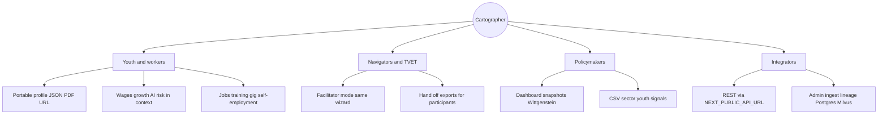
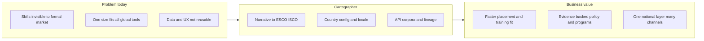
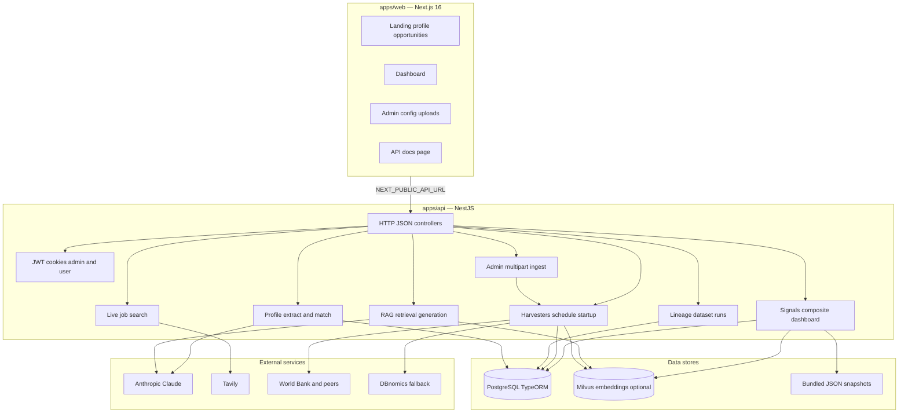
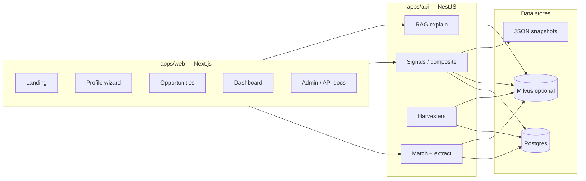
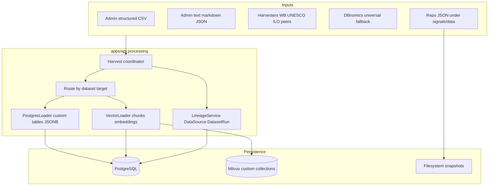
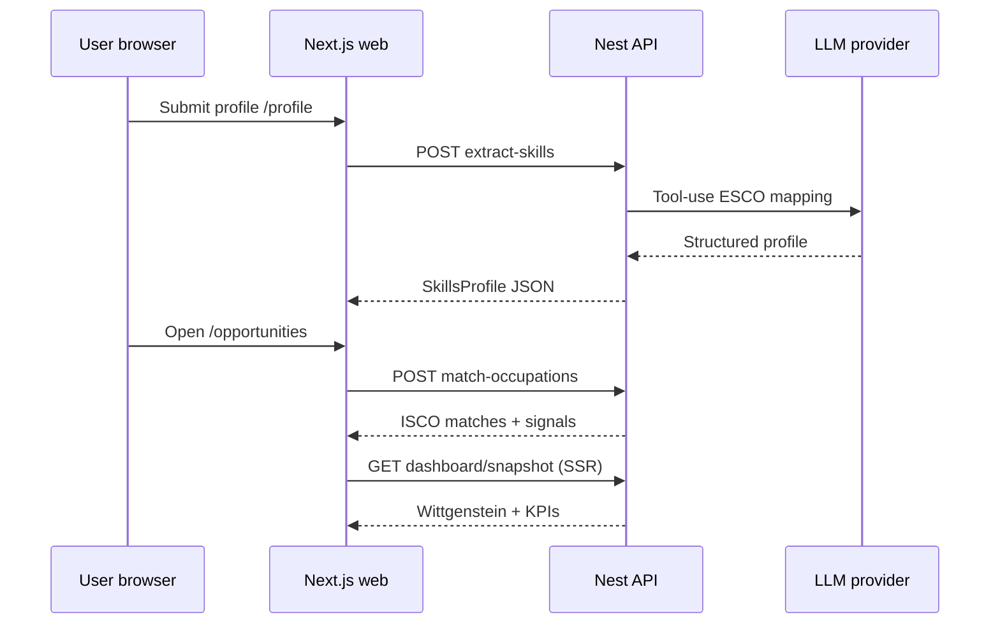
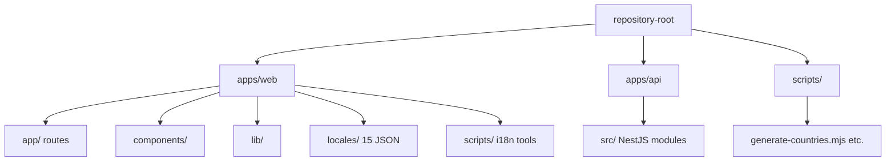

# Cartographer

> Open, localizable skills infrastructure for the AI age.
>
> **Challenge:** World Bank Youth Summit x Hack-Nation, Challenge 05
> **Status:** Hackathon prototype (built in 18 hours)

## The problem

600 million young people work in the informal economy. Their real skills (phone repair, tailoring, self-taught coding, market trading) are invisible to the formal labor market because no one has mapped them to standardized taxonomies, real wage data, or actual opportunities.

Generic job boards don't help Amara, 22, in Accra. She needs infrastructure that:

- Speaks her language (15 UI locales including EN, FR, Bangla, Swahili, and more)
- Understands her credentials (WASSCE in Ghana, SSC in Bangladesh, not "high school diploma")
- Calibrates AI displacement risk for her context, not for San Francisco
- Surfaces self-employment, gig, and training pathways, not just formal jobs that don't exist

Cartographer is the layer underneath the next generation of skills products. Country-specific parameters are **inputs**, not hardcoded assumptions.

## Business value proposition (visual)

Cartographer converts **informal, hard-to-describe experience** into **shared, inspectable infrastructure**: ESCO-grounded skills, ISCO-linked occupations, local labor-market signals, and optional RAG-backed evidence—so governments, training providers, and product teams do not rebuild the same glue code country by country.

### Stakeholder outcomes



### Problem → platform → value chain



## Actors and journeys

| Actor | Primary routes | Goal |
|--------|----------------|------|
| **Youth (Amara)** | `/`, `/profile`, `/opportunities` | Map informal and formal experience to ESCO + ISCO, see wages, growth, AI risk, pathways, and education projections; export JSON/PDF. |
| **Community navigator / training provider** | `/profile?role=navigator&country=…&locale=…` | Same wizard as the youth flow, with guidance copy; complete the profile on behalf of a participant and hand off exports. |
| **Policymaker or program officer** | `/dashboard` | Sector growth, wage distribution, youth unemployment, automation calibration, Wittgenstein chart, composite A–H-style panels, CSV export. |
| **Integrator (government, NGO, employer)** | `NEXT_PUBLIC_API_URL` (REST), `/api-docs` (web) | Plug in country data, harvesters, and optional RAG corpora without forking core matching logic. |

**Persona anchor — Amara:** 22, near Accra, secondary certificate, three languages, phone repair since 17, self-taught coding from YouTube. She is the reference user for Module 01 and the youth half of Module 03.

When the demo switches to Bangladesh, the same infrastructure reconfigures: Bangla script loads, BDT replaces GHS, SSC/HSC replace WASSCE, sector mix shifts, and the Frey-Osborne risk multiplier adjusts. **No application code changes** — only configuration and locale.

## What's in the prototype

| Module | Status | What it does |
|---|---|---|
| **01: Skills Signal Engine** | Built | Free-text story to ESCO-mapped profile, plain-English tooltips, JSON + PDF export |
| **03: Opportunity Matching & Dashboard** | Built | ESCO to ISCO match, surfaces wage + growth + AI-risk on every card, dual interface (youth + policymaker) |
| **02: AI Readiness Lens** | Light (plus youth context) | Frey-Osborne per occupation with LMIC calibration; ILO Future-of-Work style task signals in composite API; **Wittgenstein 2025–2035** chart on `/opportunities` and `/dashboard` when data is available |

### Country-agnostic by construction

Five things are configurable **without application code changes** (data + config files, Admin upload, or registry entries):

1. **Labor market data**: per-country JSON under `apps/api/src/signals/data/<code>/` (or ingested via API), wages and sector growth
2. **Education taxonomy**: `credentials.json` per country (WASSCE, NVTI, SSC, HSC, TVET, KCSE, ...)
3. **Language & script**: `apps/web/locales/*.json` dictionaries loaded by `?locale=`
4. **Automation calibration**: per-country multiplier and sector overrides
5. **Opportunity types**: formal employment, self-employment, gig, training pathways

The country registry lists **200+** ISO markets with synthesised baselines; **Ghana, Bangladesh, and Kenya** ship hand-curated ILOSTAT-style snapshots. The live demo typically switches **Ghana** and **Bangladesh** in one click.

**Navigator mode:** open `/profile?country=GH&locale=en&role=navigator` so a training provider or community navigator sees guidance when entering a profile for someone else (same flow; export JSON/PDF for the participant).

## Tech stack

- **Monorepo:** Turborepo — `apps/web` (Next.js 16 App Router + React 19 + TypeScript strict) and `apps/api` (NestJS signals, matching, RAG, harvesters)
- **Styling:** Tailwind CSS 4
- **LLM:** Anthropic Claude (skills extraction via tool-use, post-filtered against valid ESCO codes)
- **Search:** Tavily API (live formal-job listings)
- **Charts:** Recharts (youth Wittgenstein strip + policymaker dashboard)
- **i18n:** JSON locale files in `apps/web/locales/` (15 languages)
- **Data:** Curated JSON snapshots + optional **live** World Bank and other harvesters in the API; ILOSTAT-style series may be snapshotted where APIs are rate-limited
- **Deployment:** Vercel (web); API URL via `NEXT_PUBLIC_API_URL` on the web app

## Data sources & citations

All datasets are real and publicly sourced. Bundled JSON under `apps/api/src/signals/data/` includes citation metadata where applicable.

| Dataset | Used for | Source |
|---|---|---|
| ESCO Skills Taxonomy | Skill normalization | [ec.europa.eu/esco](https://ec.europa.eu/esco) |
| ISCO-08 | Occupational classification | [ilo.org/ISCO](https://www.ilo.org/public/english/bureau/stat/isco/isco08/) |
| ILOSTAT | Median wages, sector employment | [ilostat.ilo.org](https://ilostat.ilo.org) |
| World Bank WDI | Youth unemployment, sector growth | [data.worldbank.org](https://data.worldbank.org) |
| Frey-Osborne (2013) | Automation risk per occupation | *The Future of Employment*, Frey & Osborne, Oxford |
| Wittgenstein Centre | Education projections 2025 to 2035 | [wittgensteincentre.org](https://www.wittgensteincentre.org) |
| O*NET (US DOL) | Task statements (RAG / retrieval) | [onetcenter.org](https://www.onetcenter.org) |
| UNESCO UIS / ITU / UN Population (via API harvesters) | Education spend, connectivity, demographics | Mirrored or cited per harvester notes in `apps/api` |

**Not integrated:** World Bank **STEP** skill measurement microdata is not wired into this prototype (see Limitations).

## Localization (i18n)

- **15 UI dictionaries** in `apps/web/locales/*.json` (`en`, `fr`, `bn`, `es`, `ar`, `hi`, `pt`, `zh`, `sw`, `ur`, `de`, `id`, `ru`, `tr`, `vi`). Active language: `?locale=` (and optional browser autodetect in the header).
- **Reviewed translations** for the newest strings (navigator banner, resilience block, youth composite row, dashboard extension, Wittgenstein titles, account-save toast) ship for **French (`fr`)**, **Bangla (`bn`)**, and **Swahili (`sw`)** via `apps/web/scripts/locale-patches.json` + `apply-locale-patches.mjs`.
- **Other locales** keep English for those keys until you extend `locale-patches.json` or edit JSON by hand.
- After editing `en.json`, run `node apps/web/scripts/sync-locale-keys-from-en.mjs` so every file keeps the same keys for TypeScript.

## Architecture

All figures in this section are **Mermaid** diagrams: use fenced blocks with the `mermaid` language tag (for example in GitHub, GitLab, or VS Code Markdown preview).

### System architecture (containers)

How the browser app, API, external services, and stores fit together.



### Logical feature map



### Data processing, routing, and lineage

How ingested data is routed to structured vs vector storage and tied to **data sources** and **dataset runs** (for traceability and cascade delete).



Custom vector corpora use the `cartographer_custom_<slug>` collection naming convention in Milvus. Bundled JSON under `apps/api/src/signals/data/` is read by signal and dashboard code without going through the harvest coordinator.

### Request path (skills to matches)



### Repository layout

Repository folder name may still be `unmapped` on disk until the GitHub project is renamed; package names in `package.json` are `@cartographer/*`.



| Path | Role |
|------|------|
| `apps/web/app/` | Landing, profile, opportunities, dashboard, admin/config, api-docs |
| `apps/web/scripts/` | `sync-locale-keys-from-en.mjs`, `apply-locale-patches.mjs`, `locale-patches.json` |
| `apps/api/src/` | Dashboard, profile, signals, harvest, RAG, lineage, auth, … |
| `apps/api/README.md` | Nest CLI defaults (`start:dev`, tests, layout) |

### UI conventions

- **No decorative radial gradients** on the shell: body backdrop is a flat `color-mix` tint. Skeletons use **opacity pulse**, not linear-gradient shimmer.
- **Resilience** on `/opportunities` uses a **score + bar**, not a conic-gradient ring.

The web app talks to the API only through `NEXT_PUBLIC_API_URL` (default `http://localhost:4000`); legacy Next `app/api/*` routes are not used.

## Getting started

```bash
git clone https://github.com/Muhammadzeeshsn/unmapped.git
cd unmapped
pnpm install
# Web: copy apps/web/.env.example if present; set ANTHROPIC_API_KEY, TAVILY_API_KEY, NEXT_PUBLIC_API_URL
# API: configure apps/api env (database, Milvus, etc.) per apps/api README if you run the full stack
pnpm run dev            # turbo: web + api in parallel (or `pnpm run dev:web` only)
```

Open the web app (default [http://localhost:3000](http://localhost:3000)) with the API running if you need matching, snapshots, and composite rows.

## Documentation index

| Document | Contents |
|----------|-----------|
| [CLAUDE.md](CLAUDE.md) | Hackathon checklist, milestones, audit log, risk register, demo script |
| This README | Actors, localization workflow, architecture diagrams, data sources, limitations |
| [apps/web/app/api-docs/page.tsx](apps/web/app/api-docs/page.tsx) | Public REST overview (rendered at `/api-docs` when the web app runs) |
| [apps/api/README.md](apps/api/README.md) | NestJS project defaults (`start:dev`, tests, package layout) |

### Required env vars (web)

```
ANTHROPIC_API_KEY=sk-ant-...
TAVILY_API_KEY=tvly-...
NEXT_PUBLIC_API_URL=http://localhost:4000
```

## Demo flow

1. Landing page, Amara story, click **Map My Skills**
2. Enter free-text background (phone repair, self-taught JavaScript, no formal CS degree)
3. Profile generates with ESCO codes + plain-English tooltips
4. Click **See Opportunities** — matches show **wage**, **growth**, **AI risk**; optional **composite** row (wage floor, routine tasks, education projections 2030, UNESCO spend when the API has data); **Wittgenstein** chart when projections exist for that country
5. All four opportunity types shown: formal job, self-employment, gig, training
6. Toggle **Ghana** to **Bangladesh** in the header. UI, currency, sectors, credentials, language all update live.
7. Open `/dashboard` for the policymaker view with charts + CSV export.

## Limitations (honest)

This is a hackathon-scale prototype. We were deliberate about scope:

- **World Bank STEP** survey microdata is **not** integrated; skills remain self-reported and LLM-mapped, not calibrated against STEP distributions.
- **No third-party skill verification.** There is no employer or training-provider attestation layer, only **navigator mode** (`?role=navigator`) copy for facilitators using the same intake flow.
- **ILOSTAT granularity** may be snapshotted or partial depending on environment; composite and dashboard degrade gracefully when series are missing.
- **ESCO subset** in some pipelines (top skills list), not the full ~13,000. Long-tail skills may fall back to closest matches.
- **Frey-Osborne (2013)** plus LMIC multiplier is a coarse automation lens, not a forecast.
- **Tavily** job search is best-effort and coverage varies by country and language.
- **Auth is optional:** end-user signup saves profiles on the server when enabled; the portable URL / JSON / PDF path still works without an account.
- **PDF** is client-side (jsPDF); typography is functional.
- **No automated tests** in the hackathon window.
- **Locale coverage:** `fr`, `bn`, and `sw` include hand-checked strings for the newest UI; other locale files may still show English for the same keys until patches are extended.

We chose to ship something honest and end-to-end rather than something polished and partial.

## License

MIT. Use it, fork it, localize it for your country.

## Team & build provenance

Built in 18 hours by a 2-person team for the World Bank Youth Summit x Hack-Nation Challenge 05.

The commit history on this repository is the build log: each milestone in `CLAUDE.md` corresponds to a timestamped commit pushed to `main`. No squash, no rebase, no amend.
